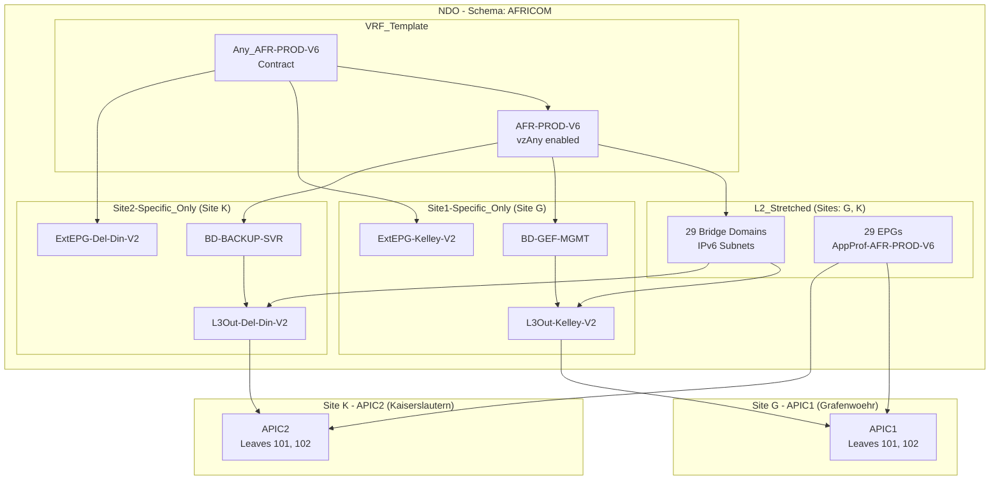

# RCC IPv6 Infrastructure - Architecture Diagram

## High-Level Architecture

```
                                    ┌─────────────────────────────────────────────────────────────┐
                                    │                          NDO                                 │
                                    │                   (Nexus Dashboard Orchestrator)             │
                                    │                                                              │
                                    │  ┌─────────────────────────────────────────────────────┐    │
                                    │  │                    Schema: AFRICOM                     │    │
                                    │  │                    Tenant: EUR                       │    │
                                    │  └─────────────────────────────────────────────────────┘    │
                                    └──────────────────────────┬──────────────────────────────────┘
                                                               │
                              ┌────────────────────────────────┴────────────────────────────────┐
                              │                                                                 │
                              ▼                                                                 ▼
              ┌───────────────────────────────┐                         ┌───────────────────────────────┐
              │         APIC1 (Site G)        │                         │         APIC2 (Site K)        │
              │        Grafenwoehr            │                         │       Kaiserslautern          │
              │                               │                         │                               │
              │  ┌─────────────────────────┐  │                         │  ┌─────────────────────────┐  │
              │  │    L3Out-Kelley-V2        │  │                         │  │    L3Out-Del-Din-V2        │  │
              │  │  (Site1-Specific_Only)      │  │                         │  │  (Site2-Specific_Only)      │  │
              │  │                         │  │                         │  │                         │  │
              │  │  ExtEPG-Kelley-V2         │  │                         │  │  ExtEPG-Del-Din-V2         │  │
              │  │  Subnet: ::/0           │  │                         │  │  Subnet: ::/0           │  │
              │  └─────────────────────────┘  │                         │  └─────────────────────────┘  │
              │                               │                         │                               │
              │  Leaves: 101, 102             │                         │  Leaves: 101, 102             │
              └───────────────────────────────┘                         └───────────────────────────────┘
```

## Template Structure

```
┌──────────────────────────────────────────────────────────────────────────────────────────────────────┐
│                                         Schema: AFRICOM                                                 │
├──────────────────────────────────────────────────────────────────────────────────────────────────────┤
│                                                                                                       │
│  ┌─────────────────────┐    ┌─────────────────────┐    ┌─────────────────────┐    ┌────────────────┐ │
│  │    VRF_Template     │    │    L2_Stretched     │    │   Site1-Specific_Only   │    │ Site2-Specific_Only│ │
│  │                     │    │                     │    │                     │    │                │ │
│  │  • AFR-PROD-V6          │    │  • 29 BDs           │    │  • BD-GEF-MGMT      │    │ • BD-BACKUP-SVR│ │
│  │  • vzAny enabled    │    │  • 29 EPGs          │    │  • EPG-GEF-MGMT     │    │ • EPG-BACKUP-  │ │
│  │  • Any_AFR-PROD-V6      │    │  • AppProf-AFR-PROD-V6      │    │  • L3Out-Kelley-V2    │    │   SVR          │ │
│  │    contract         │    │                     │    │  • ExtEPG-Kelley-V2   │    │ • L3Out-Del-Din-V2│ │
│  │  • "Any" filter     │    │                     │    │                     │    │ • ExtEPG-V2    │ │
│  │                     │    │                     │    │                     │    │   E-K          │ │
│  │  Sites: G, K        │    │  Sites: G, K        │    │  Site: G only       │    │ Site: K only   │ │
│  └─────────────────────┘    └─────────────────────┘    └─────────────────────┘    └────────────────┘ │
│                                                                                                       │
│  ┌─────────────────────┐                                                                              │
│  │  L2_Non-Stretched   │                                                                              │
│  │                     │                                                                              │
│  │  • BD-DB-SVR        │                                                                              │
│  │  • BD-SYSLOG        │                                                                              │
│  │  • EPG-DB-SVR       │                                                                              │
│  │  • EPG-SYSLOG       │                                                                              │
│  │                     │                                                                              │
│  │  Sites: G, K        │                                                                              │
│  │  (separate BDs/site)│                                                                              │
│  └─────────────────────┘                                                                              │
│                                                                                                       │
└──────────────────────────────────────────────────────────────────────────────────────────────────────┘
```

## VRF and Contract Flow

```
                              ┌─────────────────────────────────────────┐
                              │              AFR-PROD-V6                     │
                              │           (VRF_Template)                 │
                              │                                          │
                              │    vzAny ◄──── Any_AFR-PROD-V6 ────► vzAny  │
                              │  (Provider)     Contract      (Consumer) │
                              └───────────────────┬─────────────────────┘
                                                  │
                    ┌─────────────────────────────┼─────────────────────────────┐
                    │                             │                             │
                    ▼                             ▼                             ▼
        ┌───────────────────┐       ┌───────────────────┐       ┌───────────────────┐
        │   Internal EPGs   │       │   Internal EPGs   │       │   External EPGs   │
        │   (L2_Stretched)  │       │  (Site-Specific)  │       │   (Site-Local)    │
        │                   │       │                   │       │                   │
        │  EPG-NAC          │       │  EPG-GEF-MGMT (G) │       │  ExtEPG-Kelley-V2   │
        │  EPG-CFG-MGMT     │       │  EPG-BACKUP-SVR(K)│       │  ExtEPG-Del-Din-V2   │
        │  EPG-MECM         │       │                   │       │                   │
        │  EPG-NMS          │       │                   │       │  Provider/Consumer│
        │  ... (35 total)   │       │                   │       │  of Any_AFR-PROD-V6   │
        └───────────────────┘       └───────────────────┘       └───────────────────┘
```

## BD-to-L3Out Association

```
                                    L2_Stretched Template
    ┌──────────────────────────────────────────────────────────────────────────────┐
    │                                                                              │
    │   BD-NAC ────────┬─────────► L3Out-Kelley-V2 (Site G)                         │
    │                  └─────────► L3Out-Del-Din-V2 (Site K)                         │
    │                                                                              │
    │   BD-CFG-MGMT ──┬─────────► L3Out-Kelley-V2 (Site G)                         │
    │                  └─────────► L3Out-Del-Din-V2 (Site K)                         │
    │                                                                              │
    │   BD-MECM ──────┬─────────► L3Out-Kelley-V2 (Site G)                         │
    │                  └─────────► L3Out-Del-Din-V2 (Site K)                         │
    │                                                                              │
    │   ... (29 BDs with dual L3Out associations)                                 │
    │                                                                              │
    └──────────────────────────────────────────────────────────────────────────────┘

                                    Site1-Specific_Only Template
    ┌──────────────────────────────────────────────────────────────────────────────┐
    │   BD-GEF-MGMT ─────────────► L3Out-Kelley-V2 (Site G only)                    │
    └──────────────────────────────────────────────────────────────────────────────┘

                                    Site2-Specific_Only Template
    ┌──────────────────────────────────────────────────────────────────────────────┐
    │   BD-BACKUP-SVR ───────────► L3Out-Del-Din-V2 (Site K only)                    │
    └──────────────────────────────────────────────────────────────────────────────┘

                                    L2_Non-Stretched Template
    ┌──────────────────────────────────────────────────────────────────────────────┐
    │   BD-DB-SVR (G) ───────────► L3Out-Kelley-V2                                  │
    │   BD-DB-SVR (K) ───────────► L3Out-Del-Din-V2                                  │
    │   BD-SYSLOG (G) ───────────► L3Out-Kelley-V2                                  │
    │   BD-SYSLOG (K) ───────────► L3Out-Del-Din-V2                                  │
    └──────────────────────────────────────────────────────────────────────────────┘
```

## IPv6 Subnet Allocation

```
    Function Code    BD Name              IPv6 Subnet       VLAN
    ─────────────    ───────              ───────────       ────
    01               BD-NMS               0100::/56         3001
    15               BD-NAC               1500::/56         3021
    1b               BD-LB                1b00::/56         3050
    40               BD-VVOIP-MGMT        4000::/56         3064
    41               BD-VVOIP-PROXY       4100::/56         3065
    53               BD-DNS-MGMT          5300::/56         3083
    66               BD-VHOST-MGMT        6600::/56         3102
    69               BD-CFG-MGMT          6900::/56         3105
    a3               BD-ADM-DCO           a300::/56         3163
    ad               BD-AD                ad00::/56         3173
    af               BD-ADFS              af00::/56         3175
    bc               BD-AFRICOM-SVR           bc00::/56         3051
    bd               BD-AFRICOM-DNS           bd00::/56         3052
    be               BD-AFRICOM-DCO           be00::/56         3053
    bf               BD-AFRICOM-UNIX          bf00::/56         3054
    c0               BD-ACAS-SCANNERS     c000::/56         3192
    c1               BD-C2C-SCANNERS      c001::/56         3442
    c3               BD-SYSMAN            c300::/56         3195
    c5               BD-OCSP              c500::/56         3197
    c6               BD-ACAS-MGMT         c600::/56         3198
    ca               BD-PKI-SRV           ca00::/56         3055
    cb               BD-LMR               cb00::/56         3056
    d0               BD-PRINT-SVR         d000::/56         3208
    d1               BD-FILE-SVR          d100::/56         3209
    d2               BD-DHCP-SVR          d200::/56         3210
    d5               BD-SMTP-SVR          d500::/56         3213
    d6               BD-D64-PROXY         d600::/56         3057
    d7               BD-RWEB-PROXY        d700::/56         3058
    d8               BD-FWEB-PROXY        d800::/56         3059
    d9               BD-SYSLOG            d900::/56         3217
    db               BD-DB-SVR            db00::/56         3219
    dd               BD-BACKUP-SVR        dd00::/56         3221
    e0               BD-APP-SVR           e000::/56         3224
    e3               BD-FMWR-SVR          e300::/56         3060
    e4               BD-WEB-SVR           e400::/56         3228
    e6               BD-PATCH             e600::/56         3230
    e9               BD-E911-SVR          e900::/56         3061
    ec               BD-MECM              ec00::/56         3236
    ef               BD-GEF-MGMT          ef00::/56         3062
```

## Deployment Flow

```
    ┌─────────────────────────────────────────────────────────────────────────────────────────────┐
    │                                    DEPLOYMENT SEQUENCE                                       │
    └─────────────────────────────────────────────────────────────────────────────────────────────┘

    Phase 1                    Phase 2                    Phase 3                    Phase 4
    ────────                   ────────                   ────────                   ────────
    
    ┌──────────────┐          ┌──────────────┐          ┌──────────────┐          ┌──────────────┐
    │  Terraform   │          │   NDO UI     │          │   Python     │          │  Terraform   │
    │    Apply     │ ───────► │   Deploy     │ ───────► │   Script     │ ───────► │  Apply APIC  │
    │              │          │              │          │              │          │   (Optional) │
    │ bds_epgs.tf  │          │ Push config  │          │ EPG port     │          │ l3outs_apic  │
    │ l3outs_ndo.tf│          │ to APICs     │          │ bindings     │          │    .tf       │
    └──────────────┘          └──────────────┘          └──────────────┘          └──────────────┘
           │                         │                         │                         │
           ▼                         ▼                         ▼                         ▼
    Creates in NDO:           Deploys to:              Adds to EPGs:             Adds to L3Outs:
    • VRF                     • APIC1 (Site G)         • Static port             • OSPF config
    • BDs & Subnets          • APIC2 (Site K)           bindings                • Node profiles
    • EPGs                                              • VPC paths              • SVI interfaces
    • L3Outs                                           • VLANs                  
    • External EPGs                                    
    • Contracts                                        
    • BD-L3Out assoc                                   
```

## File Dependencies

```
    ┌─────────────────────────────────────────────────────────────────────────────────────────┐
    │                                                                                          │
    │                              ┌──────────────────────┐                                   │
    │                              │     main.tf          │                                   │
    │                              │  (Provider config)   │                                   │
    │                              └──────────┬───────────┘                                   │
    │                                         │                                               │
    │                              ┌──────────▼───────────┐                                   │
    │                              │   terraform.tfvars   │                                   │
    │                              │   (Credentials)      │                                   │
    │                              └──────────┬───────────┘                                   │
    │                                         │                                               │
    │               ┌─────────────────────────┼─────────────────────────┐                    │
    │               │                         │                         │                    │
    │               ▼                         ▼                         ▼                    │
    │    ┌──────────────────┐     ┌──────────────────┐     ┌──────────────────────┐         │
    │    │   bds_epgs.tf    │     │  l3outs_ndo.tf   │     │ l3outs_apic.tf       │         │
    │    │                  │     │                  │     │ (.disabled)          │         │
    │    │  Data Sources:   │     │  References:     │     │                      │         │
    │    │  • mso_schema    │◄────│  • mso_schema    │     │  References:         │         │
    │    │  • mso_site      │     │  • mso_site      │     │  • L3Outs from NDO   │         │
    │    │  • mso_tenant    │     │  • VRF           │     │    (data sources)    │         │
    │    │                  │     │  • Site BDs      │     │                      │         │
    │    │  Defines:        │     │                  │     │  Defines:            │         │
    │    │  • VRF           │     │  Defines:        │     │  • OSPF policies     │         │
    │    │  • Contracts     │     │  • L3Outs        │     │  • Node profiles     │         │
    │    │  • BDs/Subnets   │     │  • External EPGs │     │  • Interface profiles│         │
    │    │  • EPGs          │     │  • BD-L3Out assoc│     │  • SVI attachments   │         │
    │    │  • Site BDs/EPGs │     │  • ExtEPG        │     │                      │         │
    │    │  • Domains       │     │    contracts     │     │                      │         │
    │    └──────────────────┘     └──────────────────┘     └──────────────────────┘         │
    │                                                                                          │
    └─────────────────────────────────────────────────────────────────────────────────────────┘
```

---

## Mermaid Diagram (for tools that support it)



---

*Generated for RCC IPv6 Infrastructure Project*
